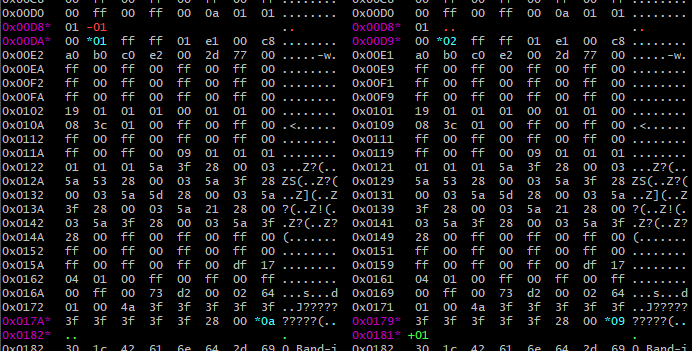

# colorbindiff
A side-by-side visual and colorized diff for binary files. 

Show on the standard output byte modifications but also additions and deletions, whatever the number of changed bytes. This is very convenient for example if you need to do reverse-engineering on a file format. Note that the algorithm is not suited for large and very different files.



# Usage
```bash
USAGE: perl colorbindiff.pl [OPTIONS] FILE1 FILE2

EXAMPLE: perl colorbindiff.pl toto.exe titi.exe | more
```

| Option | Description 
| --- | ---
|--cols=N | display N columns of bytes. Default is 16.
|--no-color | don't colorize output. Needed if you view the output in an editor.
|--no-marker | don't use the change markers ('\+' for addition, '\-' for deletion, '\*' for modified).
|--no-ascii  | don't show the ascii columns.
|--only-changes | only display lines with changes.
|--no-header | don't print the header line.

# Installation
Linux: nothing to install, just download and run the script.

Windows: install cygwin with default options. This will get you `perl` and `diff` installed. Then download and run the script.

# License
LGPL v3
